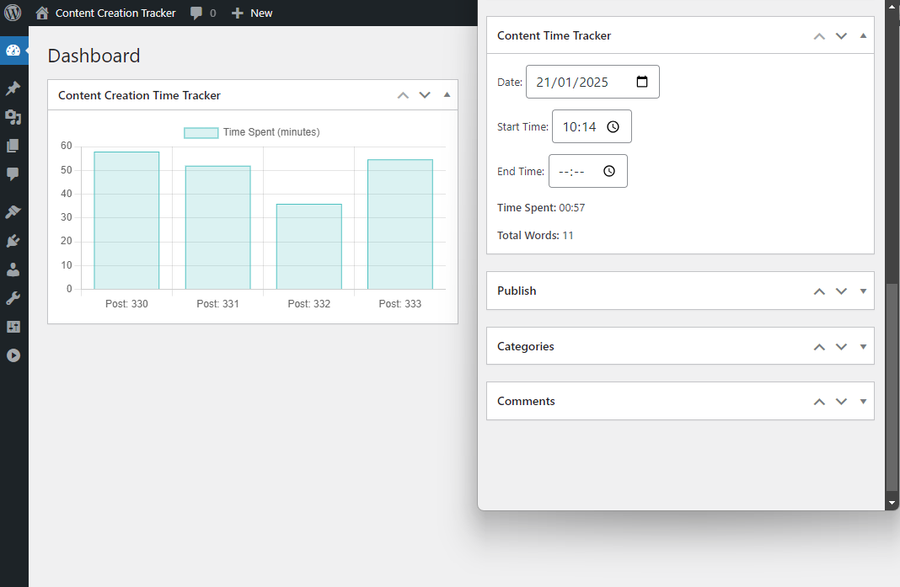
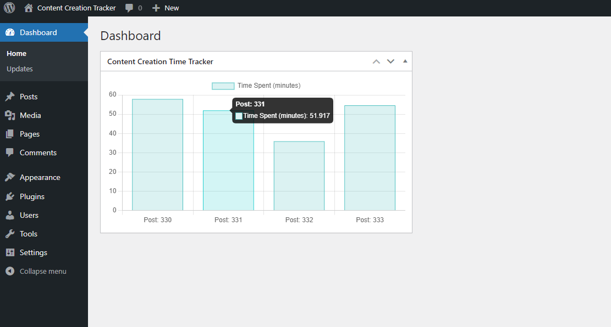
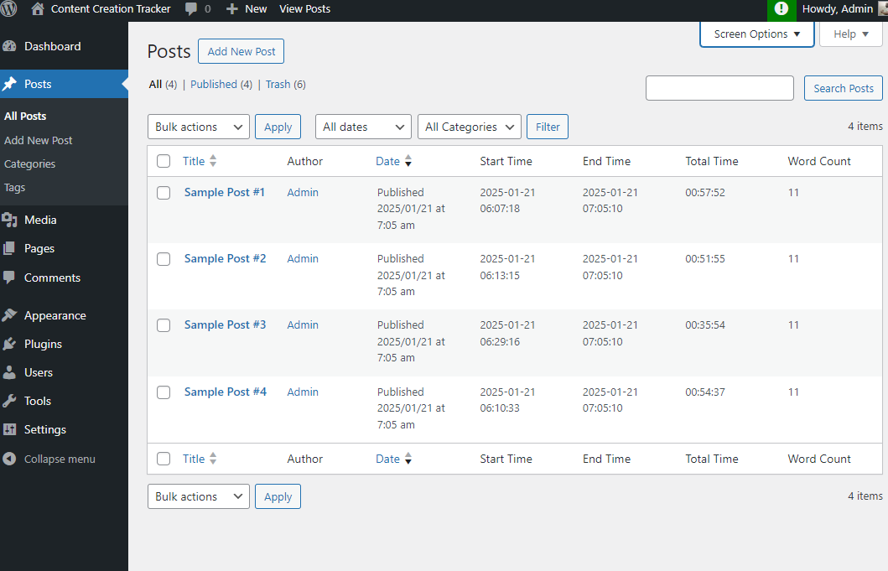
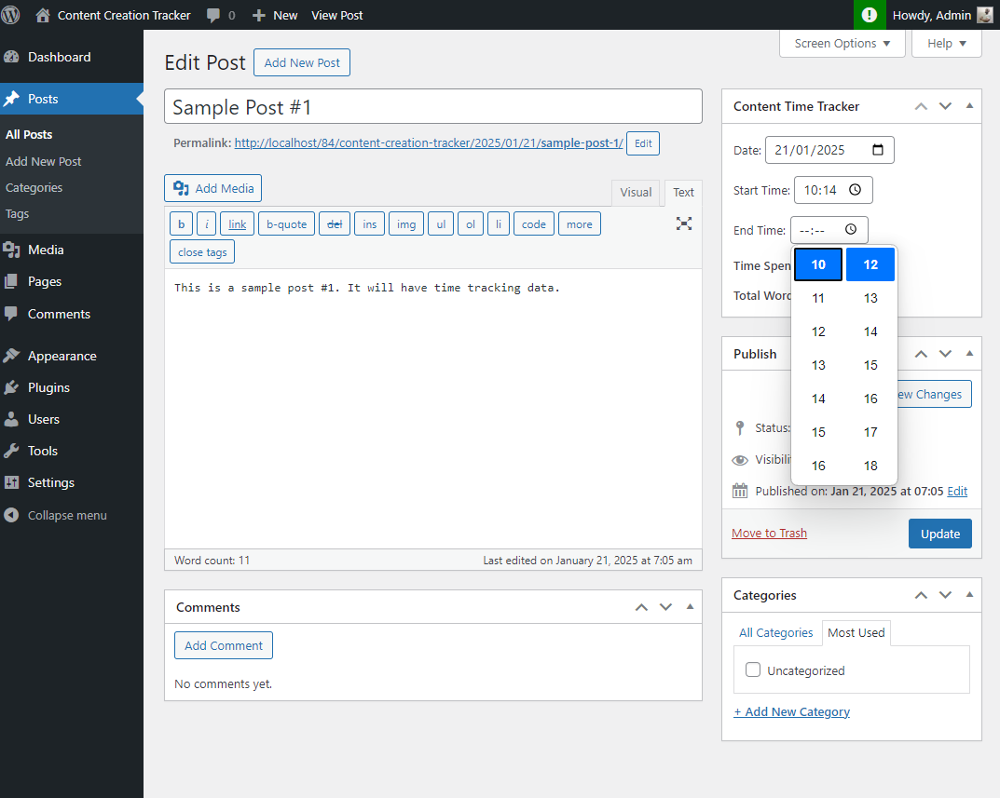

# Content Creation Tracker

**Content Creation Tracker** is a WordPress plugin designed to help users track the time spent creating content on their WordPress site. By measuring how long it takes to create each post, users can identify areas for improvement and increase their content creation efficiency. This plugin provides a simple interface to view time spent on each post and visualizes it through a dashboard widget.

## Features

- Track time spent on each post in WordPress.
- View detailed time tracking data for each post.
- Dashboard widget showing time spent on posts.
- Reduce the time taken to create posts by analyzing the data.
- Easy-to-use interface for content creators.

## Installation

1. **Download and Install the Plugin**  
   Download the plugin from the plugin repository or upload it directly via the WordPress dashboard.

2. **Activate the Plugin**  
   Go to the WordPress admin dashboard and activate the **Content Creation Tracker** plugin.

## How to Use

### 1. Tracking Time for Posts

- **Start Time**: When you begin creating a post, the plugin starts tracking the time automatically.
- **End Time**: When you finish creating the post, the plugin stops the timer and logs the time spent on the post.

### 2. Dashboard Widget

The plugin adds a widget to your WordPress dashboard that provides a summary of the time spent on posts. 

- Go to the **Dashboard** page in your WordPress admin panel.
- You will see the **Content Creation Time Tracker** widget, which displays the time spent on each post.

## Screenshots

### Dashboard Widget Example

This widget will show the time spent creating each post. The widget dynamically updates to show the most recent posts and their associated time data.

### Lists of Post with Time Data in Columns

This view provides a list of posts in the WordPress dashboard, displaying the creation time, start time, end time, and total time spent for each post. These columns give users an overview of the time tracking data at a glance, helping them to quickly analyze the content creation efficiency for each post.

### Adding the Creation Time Creating Post Page

This screenshot shows how to add the creation time data on the post editing screen. Users can manually input the start time and end time for the post, which is then used to calculate the total time spent creating the content.

## Frequently Asked Questions (FAQs)

### 1. **How do I track time for a post?**

The plugin automatically starts tracking time as soon as you begin editing a post. Once you finish editing, the plugin logs the time spent on the post.

### 2. **How do I view the time data for posts?**

The **Content Creation Time Tracker** widget on your dashboard provides a summary of the time spent on posts. You can see a bar chart visualizing this data.

### 3. **Is the time tracking feature visible to other users?**

Only admins can view the time tracking data on the dashboard widget. This ensures privacy for other users working on the site.

## Changelog

### 1.0 (January 2025)

- Initial release.
- Time tracking for each post.
- Dashboard widget to view time spent on posts.
- Visual representation of time data using a bar chart.

## Contribution

If you'd like to contribute to the plugin, please fork the repository and submit a pull request. We welcome improvements, bug fixes, and new features.

## License

This plugin is licensed under the GPLv2 or later.
